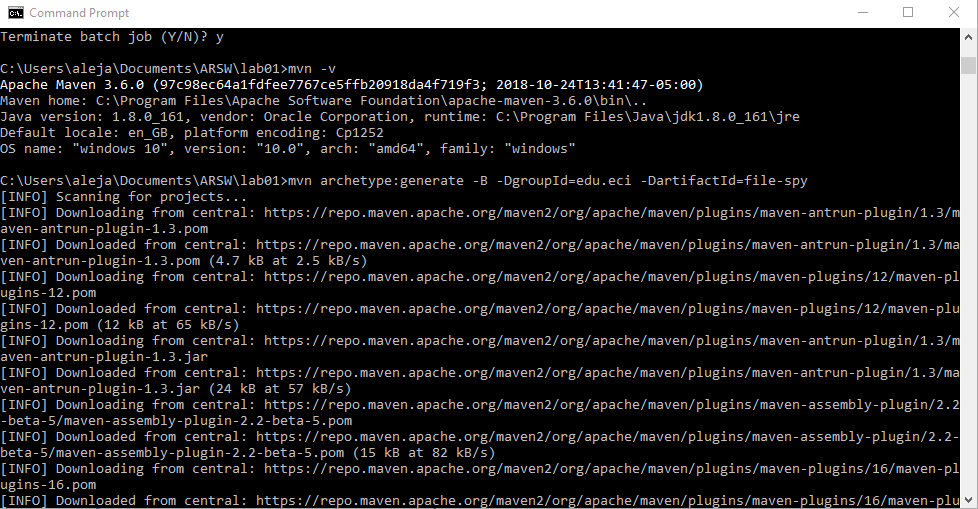
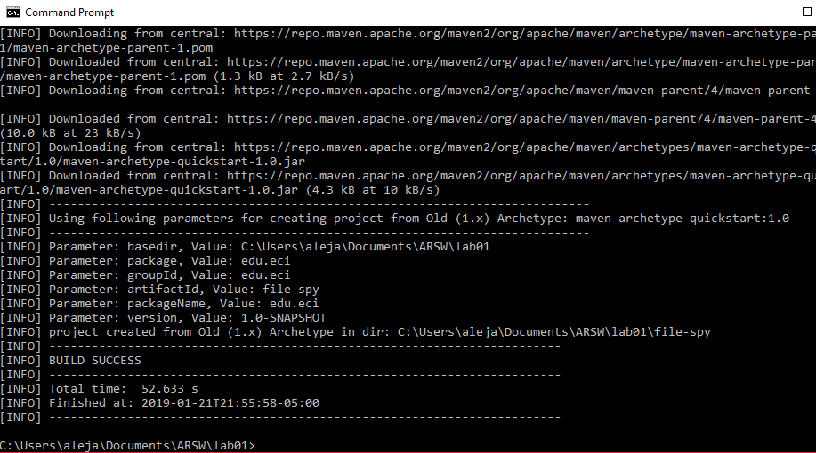
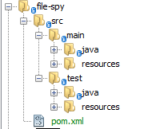
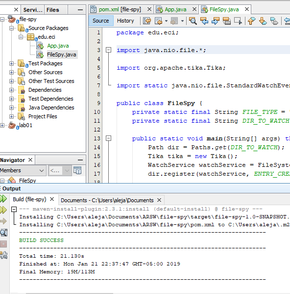
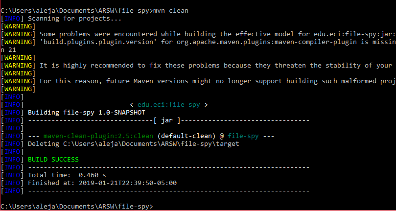
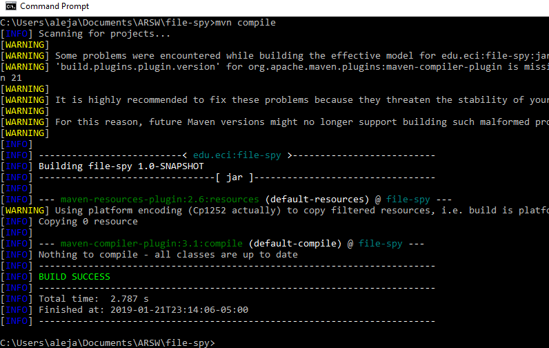
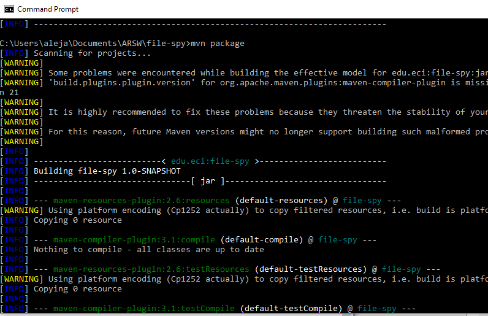
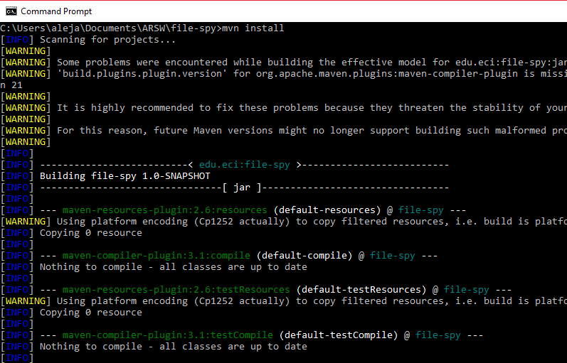
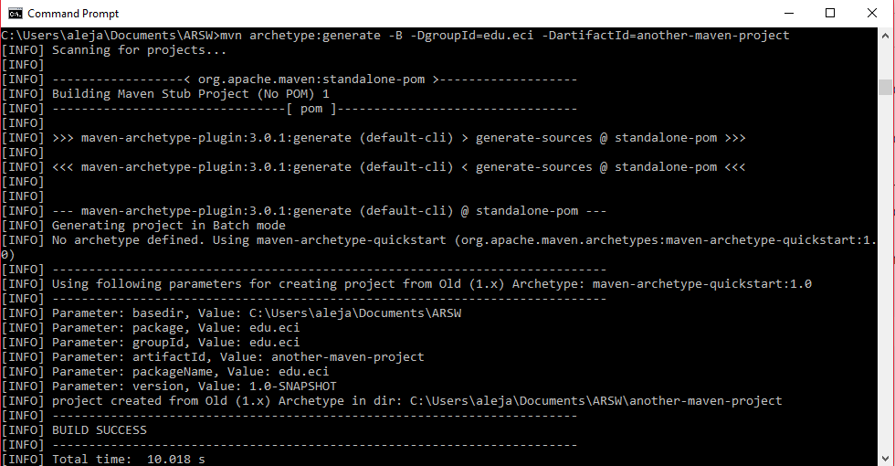
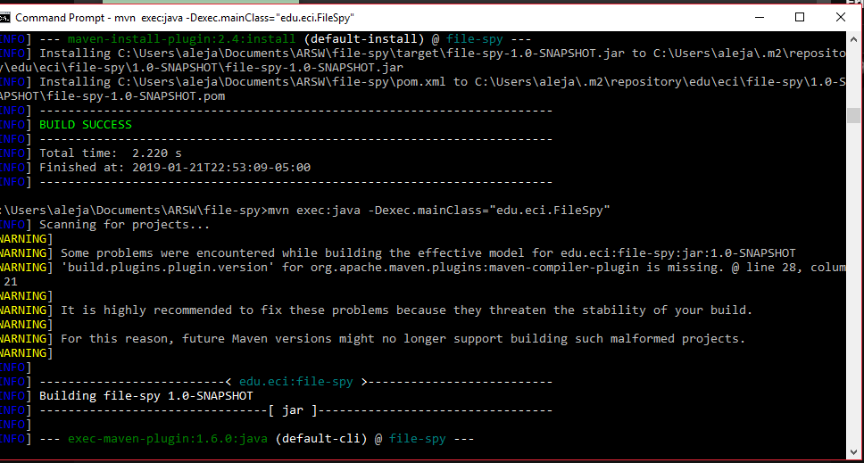

# lab01-parte2

1.

What do means the -B option in the command?

	-B = --batch-mode     
		Run in non-interactive (batch)

What do means the -D option in the command?
	
	-D = --define <arg>           
		Define a system property
		
What do means the groupId, artifactId properties in the command?

	- GroupId serves as the group identifier of our Maven project.
	- ArtifactId serves as the group-local identifier of our Maven project.

Describe the content of the directory that has been created.

Create the folders src/main/resources` and `src/test/resources

2.

What do means the word SNAPSHOT in the version value?

	- A snapshot version in Maven is one that has not been released.

What is the purpose of the packing tag into the POM file?

	-Is a container of submodules, each submodule is represented by a subdirectory in the same directory as pom.xml with pom packaging.

What is the purpose of the dependencies and dependency tags into the POM file?

	- Dependencies are the add-on's or goals that can be executed and/or used in java classes.

	
3.

The three principal Maven lifecycles areclean, defaultand site. Describe each one.

Using the terminal execute the command mvn compile. Take the output screenshot. What is this command using for? What are transitive dependencies?

- mvn compile : compile the source code of the project.
- Transitive dependencies: These are dependencies that are dependencies of our direct dependencies.

Using the terminal execute the command mvn package. Take the output screenshot. What is this command using for?

- mvn package : take the compiled code and package it in its distributable format, such as a JAR.

Using the terminal execute the command mvn install. Take the output screenshot. What is this command using for?

- mvn install : install the package into the local repository, for use as a dependency in other projects locally

Generate a new maven project in other folder using the maven command line tools, this project should has as groupId "edu.eci" and as artifactId "another-maven-project". Take the output screenshot.

Replace the code of the App.java class with the following code and do all the necessary steps to compile the code.

